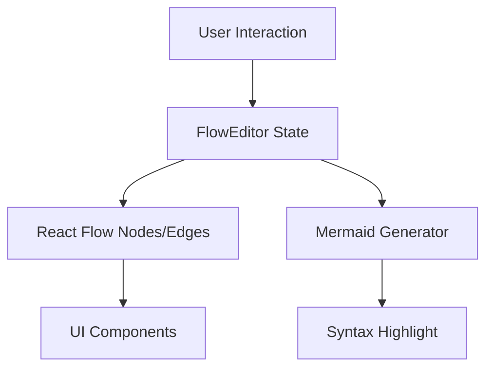

# ⚙️ 開発者ガイド

このガイドでは、Mermaid フローチャート エディターの開発環境構築から、コードベースの理解、新機能開発まで詳しく説明します。

## 🏗️ 開発環境構築

### 必要な環境

- **Node.js**: v18以上
- **pnpm**: v8以上
- **Git**: v2.30以上

### セットアップ手順

```bash
# リポジトリをクローン
git clone https://github.com/illionillion/mermaid-editor.git
cd mermaid-editor

# 依存関係をインストール
pnpm install

# Git フックをセットアップ
pnpm prepare

# 開発サーバー起動
pnpm dev
```

### 開発サーバー

[http://localhost:3000](http://localhost:3000) で開発版にアクセスできます。

## 🏛️ アーキテクチャ

### ディレクトリ構造

```
mermaid-editor/
├── app/                    # Next.js App Router
├── components/             # React コンポーネント
│   ├── editor/            # エディター系コンポーネント
│   ├── flow/              # React Flow 関連
│   ├── mermaid/           # Mermaid 出力関連
│   ├── node/              # ノード操作関連
│   ├── types/             # 型定義
│   └── ui/                # UI コンポーネント
├── utils/                  # ユーティリティ関数
├── __tests__/             # テストファイル
├── .github/               # GitHub Actions
└── docs/                  # GitHub Pages デプロイ用
```

### 主要コンポーネント

#### FlowEditor (`components/flow/flow-editor.tsx`)

- メインのフローチャートエディター
- React Flow の統合
- ノード・エッジの状態管理

#### MermaidHighlight (`components/mermaid/mermaid-highlight.tsx`)

- Mermaid コードの構文ハイライト
- リアルタイム生成とプレビュー

#### EditableNode (`components/node/editable-node.tsx`)

- インライン編集可能なノード
- ダブルクリック編集機能

#### EditableEdge (`components/flow/editable-edge.tsx`)

- インライン編集可能なエッジ
- ラベル編集機能

### データフロー



## 🛠️ 技術スタック詳細

### フロントエンド

#### Next.js 14

- **App Router**: 最新のルーティングシステム
- **SSG**: 静的生成でパフォーマンス最適化
- **TypeScript**: 型安全な開発

#### React Flow

- **ノード・エッジ管理**: ドラッグ&ドロップ機能
- **カスタムコンポーネント**: EditableNode, EditableEdge
- **レイアウト制御**: 自動配置とマニュアル配置

#### Yamada UI

- **デザインシステム**: 一貫したUI/UX
- **レスポンシブ**: モバイル対応
- **アクセシビリティ**: ARIA準拠

### 開発ツール

#### 品質管理

- **ESLint**: コード品質チェック
- **Prettier**: コードフォーマット
- **TypeScript**: 型チェック
- **Vitest**: テストランナー (97.5% カバレッジ)

#### Git管理

- **lefthook**: Git フック管理
- **commitlint**: コミットメッセージ規約
- **GitHub Actions**: CI/CD自動化

## 🧪 テスト

### テスト構成

```bash
__tests__/
└── utils/
    └── mermaid/
        ├── getSafeVariableName.test.ts
        ├── formatMermaidShape.test.ts
        ├── formatMermaidArrow.test.ts
        └── generateMermaidCode.test.ts
```

### テスト実行

```bash
# 全テスト実行
pnpm test:run

# ウォッチモード
pnpm test

# カバレッジレポート
pnpm test:coverage

# UI モード
pnpm test:ui
```

### テスト戦略

1. **ユニットテスト**: 各ユーティリティ関数
2. **エッジケーステスト**: 特殊文字、空値、エラー条件
3. **統合テスト**: 複数機能の組み合わせ

## 🔧 新機能開発

### 開発フロー

1. **Issue作成**: 機能要求や不具合報告
2. **ブランチ作成**: `feature/feature-name` 形式
3. **実装**: テスト駆動開発 (TDD)
4. **テスト**: 品質チェック通過
5. **PR作成**: レビュー・マージ

### コーディング規約

#### TypeScript

```typescript
// インターフェース定義
interface NodeData {
  label: string;
  shape: NodeShape;
}

// 関数の型注釈
const formatNode = (data: NodeData): string => {
  // 実装
};
```

#### React コンポーネント

```typescript
interface Props {
  title: string;
  onUpdate: (value: string) => void;
}

export const Component: React.FC<Props> = ({ title, onUpdate }) => {
  // 実装
};
```

### パフォーマンス考慮

#### React最適化

- `memo()` で不要な再レンダリング抑制
- `useMemo()`, `useCallback()` で重い処理を最適化
- `lazy()` で動的インポート

#### React Flow最適化

- ノード数制限（推奨: 100ノード以下）
- 大きなフローは分割推奨

## 🚀 デプロイ

### GitHub Pages

```bash
# ビルド・デプロイ
pnpm build
pnpm deploy
```

### CI/CD

GitHub Actions で自動化:

1. **Stage 1**: ESLint + Prettier (並列)
2. **Stage 2**: TypeScript 型チェック
3. **Stage 3**: テスト + カバレッジ
4. **Stage 4**: ビルド + デプロイ

## 🐛 デバッグ

### 開発ツール

#### React Developer Tools

- コンポーネント状態の確認
- パフォーマンス分析

#### Redux DevTools

- 状態管理のデバッグ（将来的な拡張）

### よくある問題

#### React Flow関連

```typescript
// ノードの位置が更新されない
const handleNodeDragStop = (event, node) => {
  // 状態更新が必要
  setNodes((prev) => prev.map((n) => (n.id === node.id ? { ...n, position: node.position } : n)));
};
```

#### Mermaid生成関連

```typescript
// 特殊文字のエスケープ
const sanitizeLabel = (label: string): string => {
  if (/^[a-zA-Z0-9\-_\u3040-\u309F\u30A0-\u30FF\u4E00-\u9FAF\s]+$/.test(label)) {
    return label;
  }
  return `"${label.replace(/"/g, '\\"')}"`;
};
```

## 📚 参考資料

### 公式ドキュメント

- [Next.js](https://nextjs.org/docs)
- [React Flow](https://reactflow.dev/)
- [Yamada UI](https://yamada-ui.com/)
- [Mermaid](https://mermaid.js.org/)
- [Vitest](https://vitest.dev/)

### 関連記事

- [React Flow カスタムノード作成](https://reactflow.dev/learn/customization/custom-nodes)
- [Next.js 静的サイトエクスポート](https://nextjs.org/docs/app/building-your-application/deploying/static-exports)
- [TypeScript プロジェクトのベストプラクティス](https://www.typescriptlang.org/docs/handbook/declaration-files/do-s-and-don-ts.html)

## 🤝 コントリビューション

詳細は [CONTRIBUTING.md](./CONTRIBUTING.md) をご覧ください。

### 質問・相談

- [GitHub Discussions](https://github.com/illionillion/mermaid-editor/discussions)
- [Issues](https://github.com/illionillion/mermaid-editor/issues)
