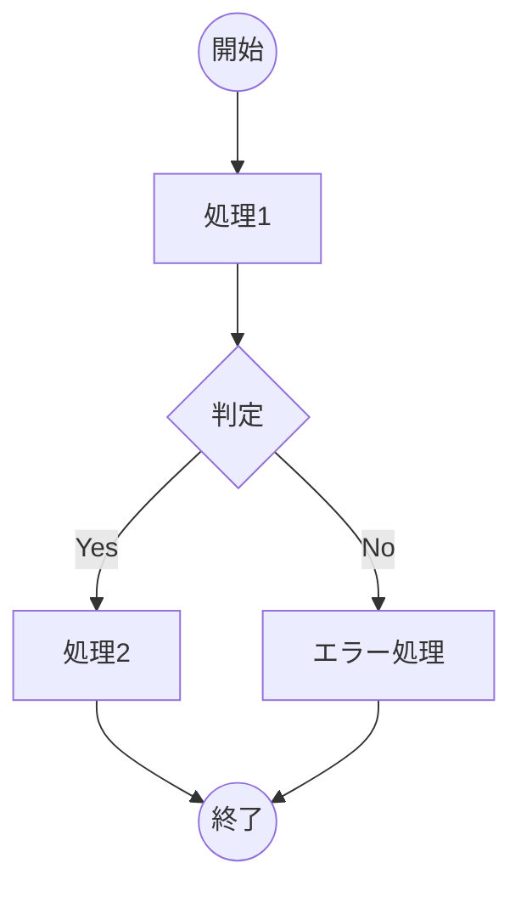
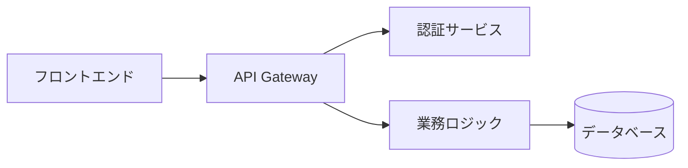

# 📘 使い方ガイド

Mermaid フローチャート エディターの詳細な使い方を説明します。

## 🎯 基本操作

### ノード操作

#### 1. ノード追加

**方法1: ボタンから追加**

- 左パネルの「ノード追加」ボタンをクリック
- 画面中央に新しいノードが追加されます

**方法2: エッジから自動生成**

- 既存のノードからエッジをドラッグ
- 空の場所にドロップすると新しいノードが自動作成

#### 2. ノード編集

**ラベル編集**

- ノードをダブルクリック
- インライン編集でテキストを変更
- Enter キーまたは他の場所をクリックで確定

**変数名編集**

- ノード左上の変数名（例: `node_1`）をクリック
- Mermaidコードでの識別子を変更可能

**図形変更**

- ノード右上のメニューボタンをクリック
- 4つの図形から選択:
  - **矩形** (`[]`): 一般的な処理ステップ
  - **円形** (`(())`): 開始・終了ポイント
  - **菱形** (`{}`): 条件分岐・判断
  - **六角形** (`{{}}`): 準備・前処理

#### 3. ノード削除

**方法1: ノードメニューから**

- ノード右上のメニューボタン → 削除

**方法2: キーボード**

- ノードを選択（クリック）
- `Delete` キーまたは `Backspace` キー

### エッジ（矢印）操作

#### 1. ノード間の接続

- 接続元ノードのハンドル（端点）をクリック
- 接続先ノードのハンドルまでドラッグ
- 自動的にエッジが作成されます

#### 2. エッジタイプの変更

エッジを選択して、右パネルで矢印タイプを変更:

- **実線矢印** (`-->`): 通常のフロー
- **点線矢印** (`-.->`)): 条件付きフロー
- **太線矢印** (`==>`): 強調されたフロー

#### 3. エッジラベルの編集

- エッジをダブルクリック
- ラベルテキストを入力・編集
- Enter キーで確定

#### 4. エッジの削除

- エッジをクリックして選択
- `Delete` キーまたはエッジメニューから削除

## 📋 コード生成・エクスポート

### Mermaidコードの生成

右パネルの「コード生成」セクションで：

1. **リアルタイム更新**: フローチャートの変更が即座に反映
2. **シンタックスハイライト**: 読みやすい色分け表示
3. **コピー機能**: ワンクリックでクリップボードにコピー

### エクスポート機能

**コピー**

- 「コピー」ボタンでクリップボードに保存
- 他のアプリケーションに貼り付け可能

**ダウンロード**

- 「ダウンロード」ボタンで `.mmd` ファイルとして保存
- Mermaid対応エディターで開ける形式

## 🎨 レイアウト・表示

### ズーム・パン操作

- **ズームイン/アウト**: マウスホイール
- **パン**: 背景をドラッグして移動
- **フィット**: 左パネルの「フィット」ボタンで全体表示

### グリッド・スナップ

- グリッドに沿ってノードが配置されます
- 整然としたレイアウトを保持

## 💡 使用例・ベストプラクティス

### フローチャートの設計パターン

**1. プロセスフロー**

**2. システム構成図**

### 効率的な作成手順

1. **骨格作成**: 主要なノードを配置
2. **接続**: 基本的なフローを接続
3. **詳細化**: ラベルや図形を調整
4. **レビュー**: 生成されたコードを確認

## 🔧 トラブルシューティング

### よくある問題

**Q: ノードが選択できない**
A: 背景をクリックして選択を解除後、再度ノードをクリック

**Q: エッジが接続できない**
A: ノードのハンドル（小さな円）を正確にクリック・ドラッグ

**Q: コードが生成されない**
A: ノードとエッジが正しく接続されているか確認

**Q: 日本語が表示されない**
A: ブラウザの文字エンコーディングがUTF-8に設定されているか確認

### パフォーマンス

大規模なフローチャート（50ノード以上）では：

- ズーム操作でパフォーマンス向上
- 不要なノード・エッジを削除
- ブラウザのメモリ使用量を確認

---

さらに詳しい情報は [開発者ガイド](./DEVELOPMENT.md) をご覧ください。
