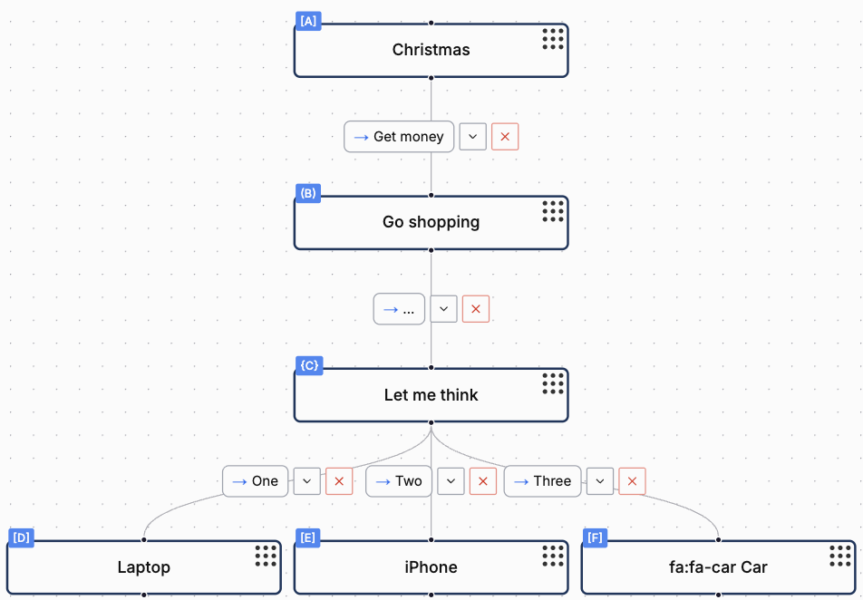
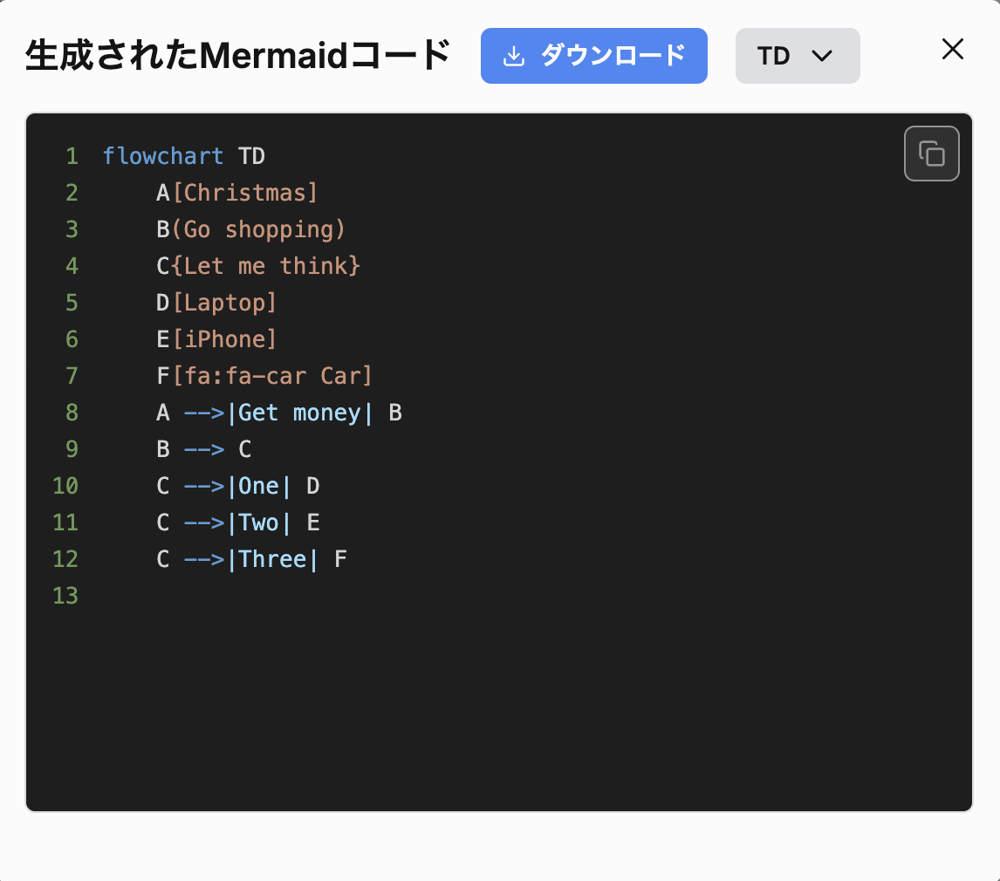
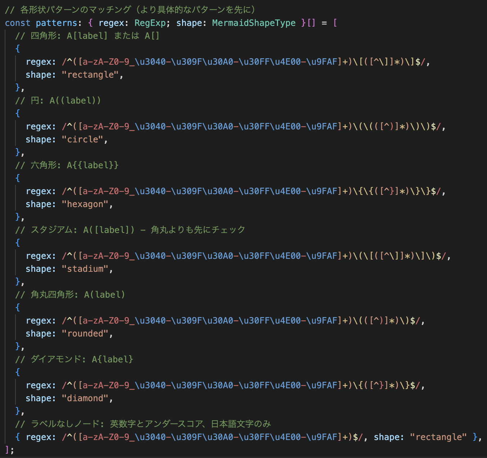

# MermaidパーサーをAIと作った話

<!-- ## 失敗から学んだAI協業のコツ -->

<!-- **5分ショートLT** -->

---

# 自己紹介 & プロダクト紹介

---

# プロダクト紹介

- ### 「Mermaid便利だけど毎回調べるのも覚えるのもめんどくさい😭」
- ### 「FigjamみたいにGUIで作れるツールがあれば良いのに🥺」
- ### ↑作ってみた

---

# 実演😎

<!--

紹介する機能

- フローチャート
  - Mermaid生成
    - 図形や矢印を選べる
  - Mermaidインポート
- ER図
  - Mermaid生成
    - 図形や矢印を選べる
  - Mermaidインポート

 -->

---

# 技術構成

### **FE** - Next.js

### **UIライブラリ** - Yamada UI

### **GUIライブラリ** - React Flow

### **デプロイ** - GitHub Pages

---

# AIに実装させた箇所

---

# Mermaid生成の文字列結合ロジック

  

    
  

  

    
  

### React Flowのデータから複雑な文字列結合をしなければならない🥺

---

# Mermaidインポートの正規表現

  
正規表現地獄🥺

  

    
  

---

# テストコード生成

### 「Mermaid変換する処理書いて」→ 失敗の繰り返し

### 先に要件を決めてテストケースを用意してからテストコードを生成

### テストコードを元に実装

---

# まとめ

### GUIはReact Flowで賄えるが、Mermaidの生成・変換ロジックは自前で作成🥺

### ゼロベースでは難しいので、先にテストケースを作成しそれを元に実装😎

### 正規表現や人間では難しい複雑なところをテスト駆動&AI生成で担保✨

---

## Thank you! 🙏

### プロダクト

**Mermaid Editor** - https://illionillion.github.io/mermaid-editor/

### ソースコード

**GitHub** - https://github.com/illionillion/mermaid-editor

**質問・議論お待ちしています！**
